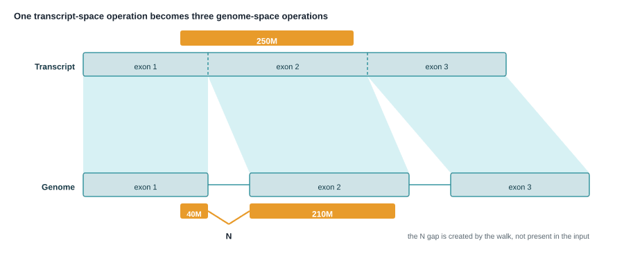
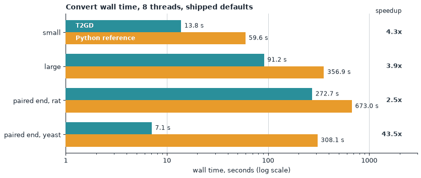
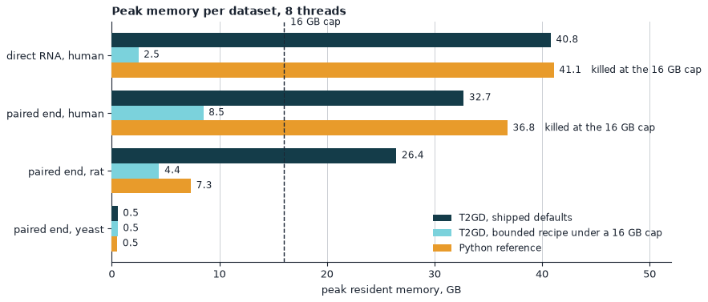
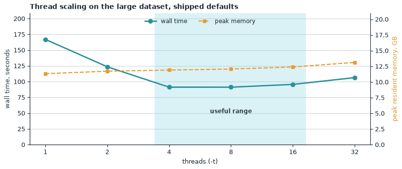
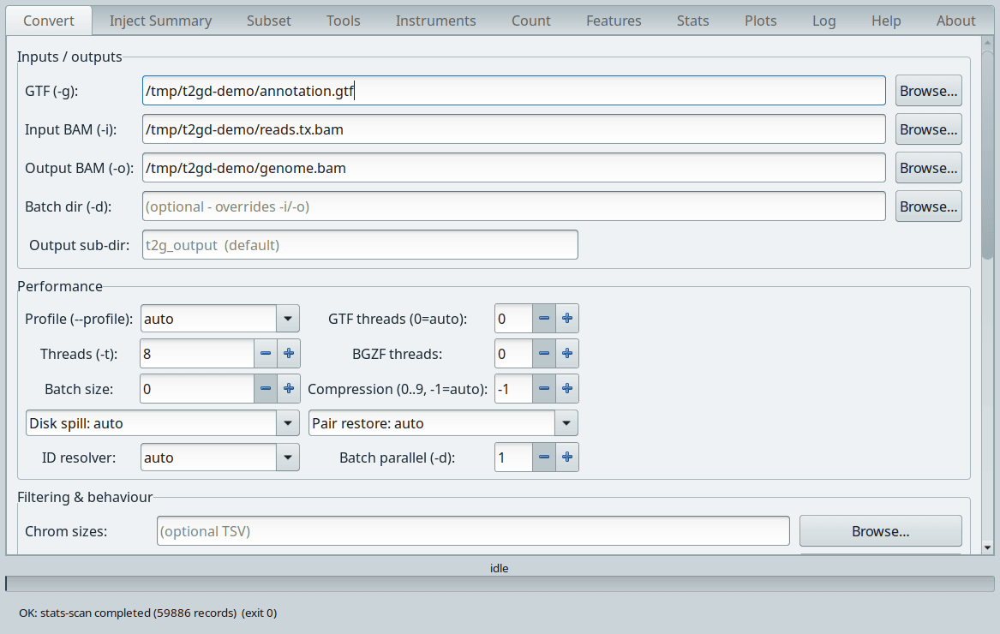
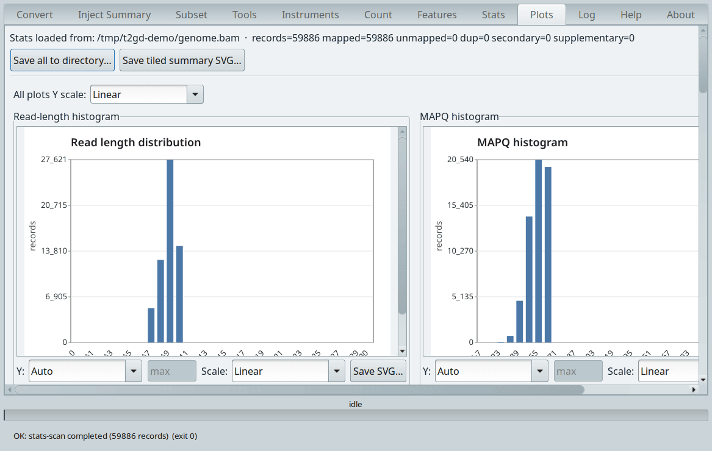
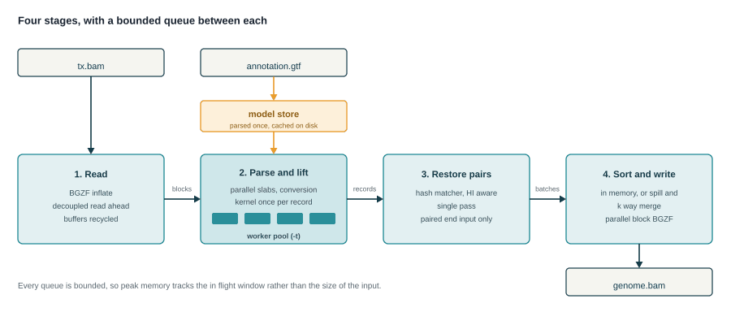

# T2GD

**Transcriptome-space to genome-space BAM conversion.**

Version 1.19.1 "Shenlong" | Linux, macOS, Windows | no dependencies | CC BY-NC-ND 4.0

[](https://doi.org/10.5281/zenodo.21744718)

T2GD converts a BAM aligned against a transcriptome FASTA into a BAM in genome
coordinates, using the GTF that defines the transcript models as the map. Each
alignment is lifted onto the genome, its CIGAR split at every exon boundary it
crosses, and an `N` operation inserted for each intron, so the converted record
is a spliced genomic alignment that genome browsers, variant callers and
coverage tools read correctly. Around that sits a self-contained BAM toolkit of
36 subcommands, and the whole thing ships as one static executable that is both
a command line tool and a desktop application.



*A read spanning an exon boundary in transcript space becomes a spliced
alignment in genome space. The CIGAR is split at the boundary and an `N`
operation covers the intron.*

---

## Why

Long-read RNA sequencing is often aligned to a transcriptome reference rather
than to the genome. For quantification that is the right choice: every read
lands on a named transcript, the alignment is unambiguous within an isoform,
and no splice-aware aligner has to guess at junctions.

The cost is that the alignments come out in transcript coordinates. The `@SQ`
lines name transcripts, not chromosomes, and a position means "base 412 of
ENST00000456328", not "chr1:12,500". Genome browsers, variant callers, junction
analyses, peak callers and most of the rest of the genomics toolchain expect
genome coordinates.

Converting is not a matter of adding an offset. Each transcript is a spliced
concatenation of exons, so a single read can straddle one or more exon
boundaries. Every CIGAR has to be walked operation by operation, split wherever
it crosses a boundary, and rejoined with an `N` operation for each intron the
read skips. Reverse-strand transcripts run backwards relative to the genome, so
the exon walk runs in reverse and the stored sequence is reverse-complemented.

That is the job T2GD does, and it does it while preserving what the record
already carried: read groups, other header content, and every aux tag. The `MM`
and `ML` base-modification tags are the case that needs care. The SAM
specification anchors them to the original read as it came off the sequencer,
not to the stored `SEQ`, so a reverse-complement must leave them alone. A
converter that helpfully reverses them silently corrupts the data.

## Key numbers

Measured on an AMD EPYC 9474F (Zen 4), shipped defaults, 8 threads, midpoint of
two recorded iterations. The reference implementation is the Python pipeline
T2GD replaces; it is published here under [python/](python/), so the comparison
can be repeated. Full tables, including the read-for-read accuracy audit, are in
the built-in **Performance and resources** topic.

Three things about this table are worth knowing before you quote it. The binary
measured was v1.17.52 against Python 5.6, several releases before the versions
published here; the conversion path did not change between them, but the
numbers were not re-run on 1.19.1. Nor is the measured binary built the way the
shipped one now is: 1.19.1 removes link-time optimisation from every published
build type, which moves timings on its own and by more than a little in places,
so treat these figures as the order of magnitude rather than as this release's
numbers. And T2GD's GTF cache was pre-warmed, as the
shipped default leaves it on, while the Python reference parses the annotation
from scratch on every run. Annotation parsing is a fixed cost that falls
entirely on the Python side of every row, and it is a large fraction of the
13.8 s small-dataset wall. Set `T2GD_GTF_CACHE=0` if you want the two to start
from the same place.

| Dataset | Reads | Input | Time | Speedup |
|---|---:|---:|---:|---:|
| Simulated human, small | 233,854 | 86 MB | 13.8 s | 4.3x |
| Simulated human, large | 2,354,046 | 885 MB | 91.2 s | 3.9x |
| Simulated human, extra large | 9,416,184 | 3.5 GB | 357.6 s | not run |
| Direct RNA, human | 3,596,790 | 1.2 GB | 188.8 s | not run |
| Paired-end, human | 13,448,662 | 544 MB | 376.7 s | not run |
| Paired-end, rat | 12,687,502 | 511 MB | 272.7 s | 2.5x |
| Paired-end, yeast | 21,531,836 | 614 MB | 7.1 s | 43.5x |

The yeast figure is real but anomalous by design: a small annotation of largely
single-exon transcripts is the easy case, and it is included to show the shape
of the workload rather than as a headline.



**Memory is bounded, not proportional to input.** Under a hard 16 GB cgroup cap,
with `--no-recover-secondary-tags --disk-spill`, T2GD converts the full 15 GB
direct-RNA human BAM of 44.9 million reads at **4.3 GB peak resident memory**.
The Python reference is killed at that cap; it completes the same input only
when given 400 GB, where it needs 178 GB and just under two hours.



Threads are useful from 4 to 16. Beyond that, coordination costs exceed the
gain.



**Accuracy.** Across 65 dataset and command combinations, 60 matched the
reference exactly. The exceptions are documented rather than hidden: two `sort`
runs differ in BGZF block boundaries while the record stream is identical, one
`convert` run drops 368 reads of 10.4 million (0.0035 percent) as
`intron_too_large`, and `count` agrees with featureCounts on 80.5 and 83.4
percent of genes on two real datasets while matching exactly on synthetic data.

Platforms produce the same records from the same input, byte for byte, so a
result does not change when you move machines. That was checked for this
release on the two Linux builds that would run on the packaging host, on
Windows under wine, and on macOS from its own build host. The znver4 build
could not be executed for the check, because the packaging host has no
AVX-512; [RELEASE_NOTES.md](RELEASE_NOTES.md) says so under Known limitations.

## Install

Download an archive from the
[latest release](https://github.com/Arnaroo/T2GD/releases/tag/v1.19.1), unpack
it, and run the binary. Nothing is installed, no runtime is required, and no
data directory is created.

| Platform | Archive |
|---|---|
| Linux x86_64, AMD Zen 4 or newer | `t2gd-1.19.1-Shenlong-linux-x86_64-znver4.tar.gz` |
| Linux x86_64, AMD Zen 2 or newer | `t2gd-1.19.1-Shenlong-linux-x86_64-znver2.tar.gz` |
| Linux x86_64, widest reach | `t2gd-1.19.1-Shenlong-linux-x86_64-broadwell.tar.gz` |
| macOS, Apple Silicon, 14 or newer | `t2gd-1.19.1-Shenlong-macos-arm64.tar.gz` |
| Windows x86_64, 10 or newer | `t2gd-1.19.1-Shenlong-windows-x86_64.zip` |

```sh
tar xzf t2gd-1.19.1-Shenlong-linux-x86_64-broadwell.tar.gz
cd linux-broadwell
./t2gd-cli --version
```

If you are unsure which Linux build to take, take `broadwell`. It runs
everywhere the others do.

Windows users who would rather not unpack a folder can take
`t2gd-1.19.1-Shenlong-windows-x86_64-setup.exe` instead. It installs the same
files, adds shortcuts and an optional `PATH` entry, and registers an
uninstaller. It needs administrator rights and it is unsigned, so SmartScreen
will object more loudly than it does to the ZIP; the ZIP remains the
recommended download. See [INSTALL.md](INSTALL.md#windows).

Every archive contains two binaries. `t2gd` is the full build and runs headless
as `t2gd --cli <subcommand>`. `t2gd-cli` contains no graphical code at all and
is the one to use on HPC nodes and in containers. On Windows the pair is
`t2gd.exe` and `t2gd-cli.exe`: double-click the first for the interface, which
opens with no console window beside it, and use the second for the command
line. The Windows archive also carries the GTK runtime, so keep the folder
together.

Full instructions, including checksum verification and the macOS quarantine
step, are in [INSTALL.md](INSTALL.md).

## Quick start

One command converts a BAM.

```sh
t2gd-cli convert -i reads.tx.bam -g annotation.gtf -o reads.genome.bam
```

That is the whole operation. The defaults size themselves from the input, the
core count and the available memory, and identifier mismatches between the BAM
and the GTF are resolved automatically.

Check the result:

```sh
t2gd-cli validate -i reads.genome.bam -g annotation.gtf
t2gd-cli junctions -g annotation.gtf -r genome.fa reads.genome.bam > sj.tsv
```

`validate` checks the converted BAM structurally against the annotation.
`junctions` catalogues every intron and classifies it against the annotated
exon boundaries and by splice motif, which is how you tell whether the
conversion landed on real introns.

For a large run on a constrained machine:

```sh
t2gd-cli convert -i reads.tx.bam -g annotation.gtf -o reads.genome.bam \
    --threads 8 --no-recover-secondary-tags --disk-spill
```

More recipes, the tuning flags, and what to do when almost everything is
skipped are in [USAGE.md](USAGE.md).

## What it can do

Two commands do the conversion work the tool exists for. The other 34 are the
BAM utility belt around it, so a conversion workflow does not need a second
toolkit installed alongside. None of them need htslib or samtools on the path.

**Convert and inject.** `convert` does the transcriptome to genome lift.
`inject-summary` adds MinKNOW per-read tags to a BAM, and can run in flight
during a conversion so the data is only walked once.

**Inspect.** `view`, `flagstat`, `idxstats`, `stats`, `depth`, `coverage`,
`bedcov`, `count`, `head`, `flags`, `samples`, `quickcheck`, `tagcheck`,
`junctions`, `validate`, `checksum`. All read-only. `flagstat`, `idxstats`,
`stats`, `depth`, `coverage` and `bedcov` are output-compatible with their
samtools equivalents, and that compatibility is verified against samtools on
every release. `checksum` proves two BAMs contain the same records irrespective
of ordering or block layout.

**Extract.** `fastq`, `fasta`, `faidx`, `dict`.

**Manipulate and transform.** `sort`, `index`, `calmd`, `fixmate`,
`addreplacerg`, `collate`, `merge`, `cat`, `reheader`, `dedup`, `subsample`,
`split`, `filter`, `encode`.

Every command that reads a GTF accepts `--gtf PATH`, spelled the same way
everywhere.

T2GD is not an aligner. Align to the transcriptome first, then hand it the BAM.
It does not build transcript models and never modifies your GTF: the annotation
is a read-only lookup. It cannot invent information that is not in the input,
so reads aligned against transcripts absent from the GTF are reported as
skipped rather than guessed at.

## The graphical interface

Run the executable with no arguments and you get a GTK 3 desktop application.
Put `--cli` in front of a subcommand to run headless instead. It is the same
binary either way. GTK is loaded at startup rather than linked, so it never
appears in the link record, but the full binary does need it present even under
`--cli`. For command line work with no GTK at all, use `t2gd-cli`.



Twelve tabs: Convert, Inject Summary, Subset, Tools, Instruments, Count,
Features, Stats, Plots, Log, Help and About. The first six run work, the next
four show you what happened, and the last two are documentation. Every
operation except `checksum` has a graphical surface.

Every tab that runs something builds a command line and hands it to the same
dispatcher the terminal uses, so anything you can do in the window has an exact
textual equivalent, and the manual gives it for each tab.



The Plots tab draws every histogram the Stats tab collected. **All plots Y
scale** sets the vertical axis for every panel at once, offering linear, log2,
log10 and natural log, and each panel has its own **Scale** selector for
anything that should differ. **Save all to directory** writes one SVG per plot
and **Save tiled summary SVG** writes a single page with everything on it.

The manual is inside the executable. Fourteen topics, about 13,500 words and
twenty figures, with a generated reference for all 36 subcommands built from
the command registry so it cannot fall out of step with the tool. Command help
bodies are shown byte for byte as `t2gd <command> --help` prints them, from the
same source, so the terminal and the interface cannot disagree. Nothing is
fetched and nothing is installed alongside, so it works on a machine with no
network.

## How it works



The input contract is a BAM whose `@SQ` names are transcript identifiers, plus
the GTF those transcripts came from. T2GD reads the GTF once into a transcript
model: for each transcript, its chromosome, its strand, and its exons in
genomic order with their cumulative transcript-space offsets.

Converting one read then means walking its CIGAR against that model. The
transcript-space start is translated to a genomic position inside the exon that
contains it. Each CIGAR operation is consumed in turn, and whenever a
reference-consuming operation would run past the end of the current exon it is
split there, an `N` operation of the intron's length is emitted, and the walk
resumes in the next exon. On a reverse-strand transcript the exon list is
traversed backwards, the record is reverse-complemented, and the `MM` and `ML`
base-modification tags are carried through byte for byte, because they index the
original read orientation rather than the stored `SEQ`. The `ro` tag records
which way the record ended up, so the transform stays auditable.

The header is rewritten so the `@SQ` lines name chromosomes with their true
lengths. `@RG` lines and other header content are preserved, and a `@PG` line
is stamped with the version and codename for provenance.

Each converted record carries tags recording where it came from: the source
transcript, its gene, the gene span, the transcript-space coordinates, the
number of introns crossed, and whether the record was reverse-complemented.
Nothing about the transcript-space alignment is lost.

Reads that cannot be placed are counted and reported by reason rather than
dropped silently. The commonest reason by far is an identifier mismatch between
the BAM and the GTF, usually a version suffix present on one side only, and the
`auto` resolver probes the header and picks between strict matching and version
stripping so this is diagnosable in one line rather than by inspection.

Memory tracks the in-flight window rather than the input size. Reads are
processed in batches, and `--disk-spill` writes each batch to a temporary BAM
and merges at the end, so peak memory stays flat as the input grows.

## Documentation

| Document | What it covers |
|---|---|
| [INSTALL.md](INSTALL.md) | Download, unpack, verify, per-platform notes, containers and HPC |
| [USAGE.md](USAGE.md) | The one command, workflows, tuning, tags, troubleshooting, the full flag reference, and a tour of the interface |
| [CHANGELOG.md](CHANGELOG.md) | What is in this release, and the known limitations |
| [RELEASE_NOTES.md](RELEASE_NOTES.md) | Artifact table and checksums for v1.19.1 |
| [python/README.md](python/README.md) | The Python reference implementation of the conversion method |

The complete manual is inside the binary. Read it with `t2gd-cli help`, or
`t2gd-cli help <topic>` for one topic, or open the Help tab in the interface.

```sh
t2gd-cli help              # topic list
t2gd-cli help how-it-works # one topic
t2gd-cli convert --help    # one command
```

## Citing T2GD

If you use T2GD in work you publish, please cite it. GitHub reads
[CITATION.cff](CITATION.cff) and will render the citation for you from the
"Cite this repository" link.

> T2GD: transcriptome-space to genome-space BAM conversion toolkit,
> version 1.19.1. Biocodecs, Arnaroo Ribologicals, COMPASS, 2026.
> https://github.com/Arnaroo/T2GD

## Licence

Everything distributed here is licensed under [CC BY-NC-ND 4.0](LICENSE): the
binaries, the documentation, and the Python reference implementation under
[python/](python/). In short, you may download, use and share them for
non-commercial purposes, and you must attribute the work; you may not modify,
repackage or redistribute a derivative, and you may not use T2GD in a
commercial product or service without written permission.

The NoDerivatives term applies to the Python source as well as to the binaries.
It is published so the method can be read, run, audited and cited, not forked.
If you need to modify it, ask us.

The T2GD D source tree is not covered by this licence and is not distributed
here. It is proprietary.

For commercial licensing, use the contact details below.

## Contact

T2GD is developed by Biocodecs, Arnaroo Ribologicals and COMPASS. Commercial
licensing enquiries go to the project home.

- Home: https://biocodecs.org
- Repository: https://github.com/Arnaroo/T2GD
- Issues: https://github.com/Arnaroo/T2GD/issues

Copyright (c) 2026 Biocodecs, Arnaroo Ribologicals, COMPASS.
