# Using T2GD

This page gets you from a transcriptome-aligned BAM to a checked genomic one,
then shows the workflows people actually run. The complete reference lives
inside the binary: `t2gd-cli help` for the topic index, and
`t2gd-cli <command> --help` for any command's full flag list.

Examples below use `t2gd-cli`, which is the command line binary on every
platform. On Windows it is spelled `t2gd-cli.exe`; use that rather than
`t2gd.exe --cli`, because `t2gd.exe` is the graphical build and has no console
to print to.

## What you need

Two inputs:

* a **BAM aligned against a transcriptome FASTA**, and
* the **GTF** that defines those transcript models.

The `@SQ` names in the BAM must be the transcript identifiers in the GTF.
That is the one hard requirement, and it is the one thing that usually goes
wrong. See [When almost everything is skipped](#when-almost-everything-is-skipped).

## The one command

```sh
t2gd-cli convert -g annotation.gtf -i reads.tx.bam -o reads.genome.bam -t 8
```

That is the whole conversion. Leave `-t` off and the profiler picks a thread
count from the input size and the machine.

The run prints a progress line with an ETA, then a summary table:

```
| Metric                       | Records |
| Read from input              |  60,000 |
| Written to output            |  59,886 |
| Skipped: unmapped            |       0 |
| Skipped: filtered out        |       0 |
| Skipped: no transcript model |       0 |
| Skipped: conversion failed   |     114 |
| Warned: large intron         |       0 |
```

Add `--explain` and T2GD prints, underneath the table, what each row counts
and what a healthy value looks like.

The output is already sorted by genome coordinate, so it can be indexed
straight away:

```sh
t2gd-cli index reads.genome.bam
```

## Check the result

Two checks are worth running every time.

**Structural validation** against the annotation. For every aligned record it
confirms the chromosome agrees with the transcript named in the `tx` tag,
that the coordinates fall inside that transcript's exons, and that the
conversion tags agree with the CIGAR. It needs no reference FASTA, and a
non-zero exit means it found problems.

```sh
t2gd-cli validate -g annotation.gtf -i reads.genome.bam
```

`convert --validate` runs the same check inline and turns a failure into exit
code 1, which is what you want inside a pipeline.

**Splice junctions**, which answers whether the conversion landed on real
introns. Every `N` operation in the converted CIGAR claims one. Compare those
claims against the annotation:

```sh
t2gd-cli junctions -g annotation.gtf -o junctions.tsv reads.genome.bam
```

Each distinct intron becomes one row with its read support, marked annotated
or novel against the GTF exon boundaries. On correctly converted data almost
everything should be annotated, because the introns were derived from the
same annotation. A large novel fraction means the GTF used for conversion was
not the one you think it was.

## Workflows

### Direct RNA long reads, human

Dorado basecalls aligned to a human transcriptome, taken to genome
coordinates, indexed and checked:

```sh
t2gd-cli convert -g gencode.v44.gtf -i drs.tx.bam -o drs.genome.bam \
    -t 8 --species human --strip-version
t2gd-cli index drs.genome.bam
t2gd-cli flagstat drs.genome.bam
t2gd-cli validate -g gencode.v44.gtf -i drs.genome.bam --strip-version
```

`--strip-version` is almost always needed with GENCODE, because the
transcriptome FASTA and the GTF disagree about version suffixes.
`--species human` sets the maximum implied intron to 500,000 bp, which is
already the default but makes the intent explicit in a script.

Base modification calls survive conversion. `MM` and `ML` are copied through
unchanged, including on reverse-strand transcripts where the record is
reverse-complemented. That is deliberate and it is what the SAM specification
requires: the tags are indexed against the original read as it came off the
sequencer, not against the `SEQ` stored in the record, so re-anchoring them to
the new strand would corrupt them. On secondary and supplementary alignments,
which often arrive without `SEQ` or without the tags at all, they are restored
from the primary read. `t2gd-cli tagcheck` counts them before and after, so
you can confirm it rather than take it on trust.

### Paired-end short reads

Mate information is lost by transcriptome alignment, because the two mates
are separate alignments to the same transcript. T2GD rebuilds it, but it has
to see both mates, and in a coordinate-sorted file they can be a long way
apart. Sort by read name first:

```sh
t2gd-cli sort -n -i reads.tx.bam -o reads.qname.bam
t2gd-cli convert -g annotation.gtf -i reads.qname.bam -o reads.genome.bam \
    -t 8 --pair-summary pairs.tsv
```

`same_tx_pairs` in the run summary should account for most of your reads. If
it is near zero, the input was not name sorted. If mates landed on different
isoforms of the same gene and you want them paired anyway, add
`--cross-transcript-pairs`; those records carry `pk` of 2 so you can tell them
apart later. `--unpaired-bam` and `--ambiguous-bam` collect the leftovers into
separate files for inspection.

### Nanopore run metadata

Carry the per-read fields from an ONT sequencing summary onto the alignments,
so downstream filtering can use channel, dwell time and q score without a
join. During the conversion:

```sh
t2gd-cli convert -g annotation.gtf -i reads.tx.bam -o reads.genome.bam \
    --summary-tsv sequencing_summary.txt \
    --inject-conflicts conflicts.tsv \
    --summary-manifest manifest.json
```

Or separately, on a BAM you already have:

```sh
t2gd-cli inject-summary -i reads.bam -s sequencing_summary.txt -o tagged.bam
```

Dorado already writes some of the same fields. The injector never overwrites
an existing value; `conflicts.tsv` lists every case where it found one, so you
can check the two sources agree before trusting either. `manifest.json`
records which columns became which tags.

Note that `inject-summary` takes `--read-threads` rather than `-t`.

### Counting genes

```sh
t2gd-cli count -a annotation.gtf -o counts.tsv reads.genome.bam
```

A featureCounts-compatible table, with an assignment summary written
alongside as `counts.tsv.summary`. Defaults reproduce featureCounts;
`--mode union` with the htseq knobs reproduces htseq-count. Several BAMs can
go into one table:

```sh
t2gd-cli count -a annotation.gtf -o counts.tsv s1.bam s2.bam s3.bam
```

This exists so a conversion and a count can share one process and one
annotation parse. It is not faster than featureCounts.

### A directory of samples on a cluster

One input per array task is the simplest and usually the fastest
arrangement:

```sh
t2gd-cli convert -g annotation.gtf -i "$INPUT" -o "$OUTPUT" \
    -t "$SLURM_CPUS_PER_TASK" --validate
```

To do a whole directory inside one job:

```sh
t2gd-cli convert -g annotation.gtf -d bams/ --output-subdir genome \
    --batch-parallel 4 --profile lowmem
```

Every input in `bams/` is converted into a `genome/` subdirectory.
`--batch-parallel 4` runs four at once, and because each of those uses its own
worker threads, pair it with `lowmem` or a small `-t` rather than with `fast`.

### A gene panel

To convert only the reads that landed on a handful of genes, give a list. One
identifier per line, blank lines and `#` comments ignored, versioned or bare
IDs both accepted:

```sh
t2gd-cli convert -g annotation.gtf -i reads.tx.bam -o panel.genome.bam \
    --gene-list panel.txt --explain
```

`--tx-list` does the same at transcript level, and the two combine as a union.
The run summary gains a `Skipped: not on gene/tx list` row so you can see how
much was held back.

This is a convenience filter for targeted panels and for cutting demo data
down to something that fits in a repository. It is not a speed feature. A whole
run conversion is already fast, and the GTF still has to be parsed in full.

### Quality control on a converted BAM

```sh
t2gd-cli stats reads.genome.bam \
    --stats reads.stats.json --stats-csv reads.stats.csv --plot qc/
```

One pass produces a hierarchical JSON, a flat two-column CSV for a
spreadsheet, and a directory of SVG figures: read length, MAPQ, CIGAR
composition, splice and indel histograms, GC and N rate, softclip lengths, tag
presence. Give `--plot` a path ending in `.svg` instead of a directory and you
get a single tiled summary page.

Paired-end fields switch on by themselves at the first paired read, and the
nanopore fields, poly(A) length, end reason, channel and q score, switch on at
the first record carrying the matching tag. Nothing needs declaring.

With neither `--stats` nor `--stats-csv`, `stats` prints one summary line to
stdout, which is what you want inside a shell loop.

### Slicing the converted BAM

`filter` is a short-circuit AND of per-record predicates, and kept records pass
through byte for byte with no tag re-encode:

```sh
t2gd-cli filter reads.genome.bam -o primary.bam --keep primary-unique --drop dup
```

The presets expand into ordinary flag tests, and `--explain-keep primary-unique`
prints the expansion without running anything. Regions can be given as samtools
coordinates, as a BED file, or, more usefully after a conversion, by name
against the same GTF:

```sh
t2gd-cli filter reads.genome.bam -o mygene.bam -g annotation.gtf \
    --region-gene ENSG00000141510
```

A gene name expands to the union of its transcripts' exonic intervals.
`--region-tsv` takes a file of them and works out from the identifier whether
each line is a gene or a transcript.

For nanopore data there is a base modification predicate. This keeps records
with at least one 5mC call at probability 0.8 or better:

```sh
t2gd-cli filter reads.genome.bam -o methylated.bam --min-mod-frac m5C:0.8
```

### Duplicates and downsampling

```sh
t2gd-cli dedup reads.genome.bam -o dedup.bam --remove
t2gd-cli subsample reads.genome.bam -o small.bam --rate 0.1 --seed 42
```

`dedup` keys on position, CIGAR and strand across primary alignments, and marks
with FLAG `0x400` unless you pass `--remove`. `--umi-tag RX` folds a UMI into
the key. A JSON sidecar records what it did.

`subsample` has four modes. `--rate` is a single pass Bernoulli keep, with the
decision hashed from the read name so mates always agree. `--reservoir N` takes
exactly N records. `--target-cov N` caps coverage per bin and writes out the
acceptance plan it used, which you can hand edit and replay with
`--subsample-plan`. `--seed` makes any of them reproducible.

### In a workflow manager

The command line is non-interactive, writes progress to stderr, and puts
output only where `-o` says. Nothing needs wrapping. A Snakemake rule:

```python
rule t2g:
    input:  bam="tx/{sample}.bam", gtf="annotation.gtf"
    output: bam="genome/{sample}.bam"
    threads: 8
    shell:  "t2gd-cli convert -g {input.gtf} -i {input.bam} "
            "-o {output.bam} -t {threads} --validate"
```

Exit codes are 0 for success, 1 for a runtime or I/O error, 2 for a usage
error.

## Tuning

The plain command is usually right. T2GD sizes itself from the input and the
machine. These are for when it is not.

### Threads

Four threads is close to the sweet spot on every dataset measured. There is
no benefit above 16 and a measurable penalty above that. If you have a whole
node and many files, run several conversions at 4 threads each rather than
one at 32.

On a shared node the profiler sees the whole machine, not your allocation, so
set `-t` to your actual CPU allocation rather than trusting the default.

### Memory

```sh
t2gd-cli convert -g annotation.gtf -i tx.bam -o genome.bam \
    --no-recover-secondary-tags --disk-spill
```

These two flags do most of the work. `--no-recover-secondary-tags` drops the
cache of primary alignments that exists to restore `MM` and `ML` tags onto
secondary records; if your data has no base modification tags this costs you
nothing at all. `--disk-spill` writes each batch to a temporary BAM and merges
at the end, so resident memory tracks the in-flight window rather than the
input size.

To go tighter, set the in-flight budget explicitly. A quarter of your memory
cap is a good starting point:

```sh
T2GD_CONVERT_BUDGET_MB=1024 \
t2gd-cli convert -g annotation.gtf -i tx.bam -o genome.bam \
    --no-recover-secondary-tags --disk-spill --profile lowmem
```

Under a 16 GB cap this recipe converts a 15 GB, 44.9 million read direct-RNA
BAM in 4.3 GB of resident memory. Below about 4 GB it does not fit at all for
a human-sized annotation.

One warning for the disk-spill path: temporary files land next to the output
by default, so make sure that filesystem has room.

**Open file limits are handled for you.** A very tight budget on a very large
input produces thousands of spill batches, and they are all opened at once
during the merge. The number of descriptors needed scales with the number of
*batches*, not with the size of the input, so a few hundred MB under a tight
budget can want more than the soft limit of 1024 that most machines ship with.
T2GD raises its own soft limit to the hard limit at start-up, which is the
opt-in those limits are designed for and is a no-op where the two are already
equal. You should not need `ulimit -n`.

Where the hard limit genuinely is low, raising the soft limit cannot help, so
`sort` and the spill merge also check the descriptor budget *before* opening
anything and fail with a message naming the knobs to change. That is a clean
refusal up front rather than a `Too many open files` error surfacing partway
into a merge.

### Presets

`--profile NAME` sets several knobs at once. Anything you set explicitly wins
over the preset.

| Preset | Threads | Batch | Compression | Sort | Pair restore |
|---|---|---|---|---|---|
| `auto` | profiler picks | 500 | 5 | in memory, spills if RAM is tight | in memory |
| `balanced` | profiler picks | 500 | 5 | in memory | in memory |
| `lowmem` | at most 4 | 250 | 3 | disk spill if a temp dir exists | streaming |
| `fast` | full default | 2000 | 1 | in memory | in memory |
| `maxcompress` | full default | 500 | 9 | in memory | in memory |

`auto` is the default and is `balanced` plus input-aware adjustments: it will
turn on disk spill by itself on a large input or a tight machine.

### Seeing what was chosen

Run with `-v` to get the profiler's decision on stderr:

```
[info] profile=auto  threads=14  threads_bgzf=6  batch_size=1500
       disk_spill=true  compression=5  (bam=12.4 GiB, gtf=86 MiB,
       cpu=16, ram=64.0 GiB)
```

Use that line as the starting point when you want to lock a configuration
with explicit flags.

### Determinism

For a fixed thread count, a fixed compression level and a fixed write path,
the output is byte-identical run to run. The profiler picks a different thread
count on different machines, so pin the values if you intend to compare
checksums across hosts:

```sh
t2gd-cli convert -g annotation.gtf -i tx.bam -o genome.bam \
    -t 8 --threads-bgzf 4 --compression-level 5 --no-disk-spill
```

Record-set equivalence holds regardless of these settings. Only the BGZF block
boundaries move, which is why two runs can produce different file checksums
while containing exactly the same alignments in exactly the same order. To
compare content rather than bytes, use `t2gd-cli checksum`, which is
order-agnostic.

## The tags T2GD writes

T2GD writes only lowercase two-character tags. The SAM specification reserves
that space for end-user applications, so nothing it adds can collide with a
standard tag. Existing tags on the input record are carried through untouched.

`convert` writes these on every successfully converted record:

| Tag | Type | Meaning |
|---|---|---|
| `tx` | Z | transcript ID the alignment was lifted from |
| `gn` | Z | gene ID of that transcript |
| `gs` | i | leftmost genomic coordinate of the alignment, 0 based |
| `ge` | i | rightmost genomic coordinate of the alignment, half open |
| `xl` | i | genomic bases actually covered, introns excluded |
| `xp` | i | genomic span of the alignment, introns included |
| `xi` | i | 1 if the alignment crosses at least one intron, else 0 |
| `im` | i | length in bp of the largest intron crossed |
| `ro` | i | 1 if the converted record is on the forward strand, -1 if reverse |
| `ds` | i | distance from the gene's 5' end to the read's 5' end |
| `de` | i | distance from the read's 5' end to the gene's 3' end |
| `es` | i | distance from the gene's 5' end to the read's 3' end |
| `ee` | i | distance from the read's 3' end to the gene's 3' end |

`pk` is written by pair restoration: 0 for a singleton, 1 for a pair on the
same transcript, 2 for a pair across transcripts. Twenty more tags come from
`inject-summary`. The full list, including the two naming caveats and the one
deliberate overlap with minimap2's namespace, is in `t2gd-cli help tags`.

`t2gd-cli tagcheck FILE` audits the base modification tags specifically. It
prints one row per alignment class, primary, secondary, supplementary and
unmapped, counting the records that lack `SEQ`, `MM`, `ML` or `MN`. Run it on
the input and again on the output and the two tables should agree on the
primary row:

```
class                records     no_SEQ      no_MM      no_ML      no_MN      no_mods
primary                59886          0      59886      59886      59886        59886
secondary                  0          0          0          0          0            0
supplementary              0          0          0          0          0            0
unmapped                   0          0          0          0          0            0
TOTAL                  59886          0      59886      59886      59886        59886
```

That is the simulated demo set, which carries no modification calls at all, so
every record counts as missing them. On real Dorado output `no_mods` should be
near zero on the primary row. `--missing FILE` writes out the read names that
are still missing calls, which is the list to trace.

## When almost everything is skipped

The run summary shows a large `no_transcript` count, or the output BAM is far
smaller than expected. Nearly always this is an identifier mismatch between
the BAM and the GTF: the transcriptome FASTA you aligned against carried
versioned IDs such as `ENST00000456328.2` and the GTF has bare ones, or the
other way round.

Check what happened:

```sh
t2gd-cli convert -g annotation.gtf -i tx.bam -o genome.bam -v 2>&1 | grep id-resolver
```

A healthy line looks like this:

```
id-resolver: strategy=strict resolved=532/532 (0 miss)
```

If `resolved` is near zero, add `--strip-version`. If the reference names also
differ by a `chr` prefix, use `--id-resolver permissive`. The default is
`auto`, which probes the header and picks between strict and strip-version,
but it cannot guess a prefix convention.

Other causes worth ruling out, in order of likelihood: `--min-mapq` set too
high, `--primary-only` dropping multimappers your aligner flagged as primary,
or `--gene-list`/`--tx-list` restricting the run more than intended.

## Other things that go wrong

**A high `intron_too_large` count.** The default maximum implied intron is
500,000 bp, which is right for human and wrong for other organisms. Use
`--species mouse` (240,000), `--species drosophila` (100,000) or
`--species yeast` (2,000), or set `--max-intron` directly. Some plant and fish
genomes need more than a million. A small number of these is normal.

**The GTF produced no transcripts.** The annotation parsed but contained
nothing usable. Check it is a GTF and not a GFF3, that it has `exon` feature
rows and not only `gene` rows, and that it is not truncated. GFF3 is a
different format and will not parse into transcripts.

**Sequence lengths in the header are wrong.** T2GD builds the `@SQ` lines from
the chromosomes the GTF mentions, and with nothing better to go on it sets
each length to the largest annotated coordinate plus one megabase, a safe
overestimate but not the true length. Tools that need exact lengths, variant
callers in particular, should be given the real values with
`--chrom-sizes genome.fa.fai`. Any two-column file of name and length will do.

**A command refuses to write.** `merge`, `collate` and `cat` will not silently
replace an existing output. Pass `-f` if you meant to overwrite. `convert` and
the other writers overwrite without asking.

Full troubleshooting is in `t2gd-cli help troubleshooting`.

## Command reference

Two subcommands do the conversion work. The other 34 are the BAM utility belt
around it, so a conversion workflow does not need a second toolkit installed
alongside. What follows explains what each parameter does and when you would
reach for it. The authoritative flag list is always
`t2gd-cli <command> --help`, which is generated from the command registry and
therefore cannot drift from the binary.

### Global flags

These are accepted before or after the subcommand.

| Flag | Effect |
|---|---|
| `-v` | detailed console logging: profiler decisions, per-phase timings, the id-resolver line |
| `-vv` | debug level, every internal phase |
| `--quiet` | suppress everything except errors |
| `--log-file PATH` | write the run log to a file as well as the console. Give a directory and the name is generated as `t2gd_<subcommand>_<timestamp>_run.log` |
| `--log-verbosity 0..3` | detail level of the file log, set independently of the console: 0 warnings, 1 info, 2 phases, 3 debug |

So a quiet console with a full log on disk is `--quiet --log-file run.log
--log-verbosity 3`, which is the arrangement to want in a batch job.

There are also info flags, which print and exit:

| Flag | Prints |
|---|---|
| `-V`, `--version` | the version banner |
| `--version-plain` | one paragraph, no box drawing |
| `--version-json` | a single JSON line, for Snakemake or Nextflow provenance |
| `--about` | the project description |
| `--license` | the binary licence |
| `--list-known-summary-fields` | the MinKNOW column to BAM tag table |
| `-h`, `--help` | the subcommand index, or one command's reference |

### convert

The conversion itself. Everything else in the toolkit exists to feed it or to
check it.

#### Inputs and outputs

| Flag | Meaning |
|---|---|
| `-g`, `--gtf PATH` | the annotation, plain or gzipped. Required. Defines the transcript models the BAM was aligned against |
| `-i`, `--input-bam PATH` | the transcriptome-space BAM |
| `-o`, `--output-bam PATH` | where the genome-space BAM goes. Created, or overwritten if it exists |
| `-d`, `--directory PATH` | batch mode: convert every `*.bam` under this directory. Mutually exclusive with `-i` and `-o` |
| `--output-subdir NAME` | where batch outputs land, as a subdirectory of `-d`. Default `t2g_output`. One `<input>.genome.bam` per input |
| `--batch-parallel N` | convert N files at once. Default 1, sequential |

`--batch-parallel` multiplies: total worker threads are roughly N times the per
file thread count, so on a small machine pair it with a small `-t` or with
`--profile lowmem`.

#### What gets skipped

Every skip is counted and reported by reason. Nothing is dropped silently.

| Flag | Meaning |
|---|---|
| `--max-intron BP` | skip a read if converting it would imply an intron longer than this. Default 500,000 |
| `--warn-intron BP` | warn, but keep, above this. Default 100,000 |
| `--species NAME` | a preset for `--max-intron`: human 500,000, mouse 240,000, drosophila 100,000, yeast 2,000 |
| `--min-mapq N` | skip reads below this mapping quality. Default 0, which keeps everything |
| `--primary-only` | drop secondary and supplementary alignments |
| `--direct-only` | drop reads on minus-strand transcripts, so nothing is reverse-complemented |

The intron limit is the one that catches people out. It is not a property of
the read, it is a property of the transcript model: a read spanning an exon
junction implies the intron between them. Set it for your organism, not for
your read length.

#### Restricting the run

| Flag | Meaning |
|---|---|
| `--gene-list PATH` | convert only reads on the transcripts of these genes, one `gene_id` or `gene_name` per line |
| `--tx-list PATH` | convert only reads on these transcripts, one `transcript_id` per line |

Both ignore blank lines and `#` comments, take versioned or bare identifiers,
and combine as a union.

#### Matching BAM names to GTF names

| Flag | Meaning |
|---|---|
| `--strip-version` | strip the `.N` suffix from GTF transcript identifiers |
| `--id-resolver MODE` | how `@SQ` names are matched to GTF transcripts |

The modes are `auto`, the default, which probes the header and picks strict if
everything matches and strip-version otherwise; `strict`, exact match only;
`strip-version`, tolerating a `.N` mismatch in either direction; and
`permissive`, which adds tolerance of a `chr`, `Chr` or `CHR` prefix. `auto`
handles the version case on its own but cannot guess a prefix convention, so
`permissive` is the one to reach for when the references differ by more than a
suffix.

#### Fidelity of the converted record

| Flag | Meaning |
|---|---|
| `--no-preserve-cigar` | collapse `=` and `X` operations into `M`. The default keeps them distinct |
| `--no-recover-secondary-tags` | turn off secondary and supplementary tag recovery, which is otherwise on |
| `--chrom-sizes PATH` | a two-column file of chromosome and length, used for the `@SQ` lengths instead of T2GD's estimate |

Tag recovery is worth understanding before you turn it off. Secondary
alignments frequently arrive with no `SEQ` at all, and supplementary alignments
arrive hard clipped, so full-read `MM`, `ML` and `MN` tags cannot legally
attach to them. Recovery injects the sequence into `SEQ`-less secondaries,
reconstructs hard clipped supplementaries to full length by turning `H` into
`S`, and copies the modification and ONT signal tags across from the primary.
It matters most when a read's primary transcript is absent from the GTF but a
secondary's is present, because without it those modification calls are simply
lost.

The cost is two light pre-passes over the input to build a frozen primary
cache. Turn it off with `--no-recover-secondary-tags` for the legacy fast path,
which is also the setting that reproduces the Python reference implementation's
output byte for byte. If your data has no base modification tags it costs you
nothing to turn off. It is skipped automatically under `--primary-only`.

#### Pair restoration

Transcriptome alignment loses mate information, because the two mates become
separate alignments. Restoration is on by default and needs name-grouped input.

| Flag | Meaning |
|---|---|
| `--no-pair-restore` | skip it entirely |
| `--cross-transcript-pairs` | pair mates that landed on different isoforms. Those records get `pk` of 2 |
| `--unpaired-bam PATH` | collect singletons, `pk` of 0, into their own file |
| `--ambiguous-bam PATH` | collect reads that could not be resolved |
| `--pair-summary PATH` | a TSV summary of what was restored |
| `--pair-in-memory` | ask for the in-memory matcher |
| `--pair-streaming` | force the streaming matcher, which is what `lowmem` uses |

#### MinKNOW tag injection

Run the injection in the same pass as the conversion rather than as a second
one over the whole file.

| Flag | Meaning |
|---|---|
| `--summary-tsv PATH` | an ONT `sequencing_summary.txt`, plain or gzipped |
| `--summary-json PATH` | an ONT `report*.json` |
| `--inject-conflicts PATH` | a TSV of every case where Dorado had already written the tag |
| `--summary-manifest PATH` | a JSON record of which columns became which tags |

Column order in the summary does not have to match anything, and unknown
columns are ignored. The five tags Dorado may already have written, `ch`, `mx`,
`st`, `du` and `f5`, are written only if absent, and each collision goes to
`--inject-conflicts` so you can check the two sources agree.

#### Performance

| Flag | Meaning |
|---|---|
| `--profile NAME` | `auto`, `lowmem`, `fast`, `balanced` or `maxcompress`. See the preset table above |
| `-t`, `--threads N` | conversion workers |
| `--threads-bgzf N` | BGZF block compression parallelism on the writer |
| `--compression-level N` | BGZF deflate level, 0 to 9 |
| `--batch-size N` | records per worker batch |
| `--gtf-threads N` | GTF parser workers. 0 is auto, cores minus one capped at 8; 1 is serial. Gzipped GTFs always parse serially |
| `--disk-spill` | force per-batch temporary BAMs and a k-way merge at the end |
| `--no-disk-spill` | force the in-memory sort even on a large input |
| `--no-sort` | skip the final coordinate sort altogether |
| `--no-swap` | cap the working set at 0.85 of available memory. This is the default |
| `--allow-swap` | lift that cap. A softer 0.7 envelope still drives back-off |

Anything set explicitly wins over the profile preset.

#### Checking and reporting

| Flag | Meaning |
|---|---|
| `--validate` | run the structural check on the output before exiting. Any failure becomes exit code 1 |
| `--explain` | print a legend under the summary table saying what each row counts and what a healthy value looks like |
| `--stats PATH` | a statistics JSON over the output |
| `--stats-csv PATH` | the same as a flat CSV |
| `--profile-trace PATH` | per-stage start and end timestamps as a JSON sidecar. Unrelated to `--profile`, and off unless asked for |

In batch mode the `--stats` path is ignored and sidecars are written beside
each output instead, named `<base>.genome.stats.json` and `.csv`.

#### Deprecated

`--parallel-write` is subsumed by `--profile` and `--disk-spill`, and
`--verbose` is replaced by `-v` and `-vv`. Both warn and carry on.

### inject-summary

The standalone form of the injection above, for a BAM you already have.

| Flag | Meaning |
|---|---|
| `-i`, `--input-bam PATH` | the BAM to read |
| `-s`, `--summary PATH` | the sequencing summary, `.txt`, `.gz` or `.json` |
| `-o`, `--output-bam PATH` | the tagged BAM |
| `--inject-conflicts PATH` | per-record conflict TSV |
| `--summary-manifest PATH` | per-run JSON manifest |
| `--compression-level N` | BGZF level, default 5 |
| `--read-threads N` | BGZF decode threads. Note this command has no `-t` |

### Inspecting a BAM

All read-only. `flagstat`, `idxstats`, `stats`, `depth`, `coverage` and
`bedcov` are output-compatible with their samtools equivalents, and that
compatibility is verified against samtools on every release.

| Command | What it does | The flags that matter |
|---|---|---|
| `view` | count, decode to SAM text, or collect statistics | `-c` count only, `--sam` decode, `-o` write to a file, `--stats`/`--stats-csv` |
| `flagstat` | the canonical 16-line FLAG tally | `-@` decode threads |
| `idxstats` | mapped and unmapped counts per reference | uses `.bai` if present, otherwise indexes in memory |
| `stats` | the full statistics catalogue | `--stats`, `--stats-csv`, `--plot` |
| `depth` | per-base read depth | `-a` include zero depth, `-J` count deletions, `-q`/`-Q` quality floors, `-G`/`-g` adjust the FLAG filter |
| `coverage` | per-reference coverage table | `-q`/`-Q` quality floors, `-d` depth cap, `--ff`/`--rf` FLAG sets |
| `bedcov` | summed depth per BED region | `-j` do not span `D` and `N`, `-d N` also count positions at depth N or more |
| `count` | assign reads to GTF features | `-a` annotation, `-o` table, `--mode`, `-s` strandedness, `--paired`, `--count-read-pairs` |
| `head` | header, and optionally the first records | `-h` header lines, `-n` records |
| `flags` | decode or encode a SAM FLAG | takes integers or comma-separated names |
| `samples` | the `@RG` `SM` samples in each file | `-T` report a different `@RG` tag |
| `quickcheck` | is the file structurally intact | silent on success, the verdict is the exit code |
| `tagcheck` | modification tag and `SEQ` coverage by alignment class | `--missing PATH` writes the reads still lacking calls |
| `junctions` | the splice junction catalogue | `-g` mark annotated against novel, `-r` classify by splice motif, `--min-support`, `--plot` |
| `validate` | structural check of a converted BAM against its GTF | `--explain`, `--report` for a JSON sidecar |
| `checksum` | order-agnostic content checksum | `-t '*'` all tags, `-P`/`-C`/`-M` add position, CIGAR and mate columns |

Two of these are specific to conversion work. `validate` confirms that the
chromosome resolved from `refId` matches the transcript in the `tx` tag, that
the coordinates sit inside that transcript's exons, and that the conversion tag
block agrees with the CIGAR and position. `junctions` resolves strand from the
best evidence available, splice motif first if you gave it `-r`, then
minimap2's `ts` tag corrected to genomic orientation, then the FLAG, and it
records which one answered in a `strand_src` column so a FLAG-derived call is
never mistaken for a motif-derived one.

`checksum` is the tool for comparing content across a sort, a split or a merge,
where the bytes will differ but the alignments should not.

### Extracting sequence

| Command | What it does | The flags that matter |
|---|---|---|
| `fastq` | reads to FASTQ | `-1`/`-2`/`-0`/`-s` route mates and singletons, `-f`/`-F` FLAG filters, `-n`/`-N` control the `/1` `/2` suffix |
| `fasta` | the same to FASTA | as above |
| `faidx` | build a `.fai`, or fetch a subsequence | regions are 1-based inclusive, `NAME:START-END` |
| `dict` | a sequence dictionary for a FASTA | `-a` assembly, `-s` species, `-u` URI |

Reverse-strand reads are reverse-complemented on the way out, and their
qualities reversed with them. Collate first with `t2gd-cli sort -n` if you want
pairs and singletons routed correctly, because the routing works on adjacent
records sharing a name.

### Writing a new BAM

| Command | What it does | The flags that matter |
|---|---|---|
| `sort` | coordinate or queryname sort | `-n` by name, `--ram-mb` chunk budget, `--tmp-dir`, `--index` build the `.bai` too |
| `index` | build a `.bai` | `-o` output path |
| `calmd` | recompute `MD` and `NM` against a reference | `-b` write BAM, needs `-o` |
| `fixmate` | repair mate fields | `-r` drop unmapped and non-primary, `-m` add the `ms` tag. Input must be name grouped |
| `addreplacerg` | add or replace `RG` | `-R` an existing ID, `-r` a full `@RG` line, `-m orphan_only` |
| `collate` | group reads by name without a full sort | `-n` partition count, `-T` temp directory |
| `merge` | k-way merge of sorted BAMs | `-n`/`-N` queryname inputs, `-f` overwrite |
| `cat` | concatenate BAMs with identical `@SQ` | `-f` overwrite. Use `merge` if the references differ |
| `reheader` | rewrite the header only | `--rename-sq OLD:NEW`, `--add-rg`, `--strip-pg`, `--strip-co` |
| `dedup` | mark or remove duplicates | `--remove`, `--umi-tag`, `--dedup-tiebreak`, `--dedup-ram` |
| `subsample` | downsample | `--rate`, `--reservoir`, `--target-cov`, `--subsample-plan`, `--seed` |
| `split` | fan out into many BAMs | `--split-by reference\|readgroup\|strand\|round-robin`, `--split-dir` |
| `filter` | predicate record selection | see the slicing section above |
| `encode` | SAM text to BAM | the inverse of `view --sam` |

`sort`, `filter`, `split`, `subsample`, `dedup`, `cat` and `reheader` all pass
kept records through byte for byte. Tag payloads are never decoded and
re-encoded, which is the same contract the conversion kernel keeps, and it is
why a `view --sam` and `encode` round trip is byte-identical on every aux
field.

`collate` deserves a note. It shuffles records into name adjacency rather than
sorting them, so it is much cheaper than `sort -n` and is the right input for
`fixmate` and `fastq`. The arrangement is deterministic and independent of the
thread count, but it is not the same arrangement samtools produces, because
samtools' order is defined by its internal hash. Both preserve the record set
and group every name contiguously.

### Environment variables

These change parallelism and memory only. They never change the output bytes.
Booleans take `1`, `on`, `yes` or `true` to enable and `0`, `off`, `no` or
`false` to disable.

| Variable | Effect | Default |
|---|---|---|
| `T2GD_GTF_CACHE` | cache the parsed GTF. Set a path to place it, `0` to disable | on, in the XDG cache directory |
| `T2GD_CONVERT_BUDGET_MB` | in-flight conversion window budget | 2048 |
| `T2GD_CONVERT_SLAB` | slab-parallel parse and convert | on |
| `T2GD_SLAB_BYTES` | slab size in bytes | 8388608 |
| `T2GD_SLAB_BUDGET_MB` | aggregate slab buffer budget | varies by command |
| `T2GD_SLAB_RECYCLE` | reuse slab backing buffers | on |
| `T2GD_PAIR_SHARD` | parallel qname-hash pair matcher | on |
| `T2GD_BGZF_PREFETCH` | decoupled read-ahead BGZF decode | on for `convert`, `view` and `stats` |
| `T2GD_BGZF_RECYCLE` | reuse decode buffers | as above |
| `T2GD_BGZF_RING_MB` | in-flight decode ring budget, MiB | 64, 0 for unbounded |
| `T2GD_BGZF_WRITE_MB` | encoder queue budget, MiB | unbounded |
| `T2GD_MERGE_BGZF` | merge writer threads on the disk-spill path | `--threads-bgzf`, else the lesser of cores and 4 |

The GTF cache is the one with a visible effect on wall time, because it removes
the annotation parse from every run after the first on the same file. Disable
it when timing a cold conversion, or the comparison will flatter T2GD.

`T2GD_CONVERT_BUDGET_MB` is the knob for a hard memory cap. A quarter of the
cap is a reasonable starting point.

### Exit codes

| Code | Meaning |
|---|---|
| 0 | success |
| 1 | an I/O or runtime error: a missing file, a BAM that would not parse, or a `--validate` run that found failures |
| 2 | bad usage: an unknown flag, a missing value, or conflicting flags such as `-i` together with `-d` |

`quickcheck` uses the same convention, so `t2gd-cli quickcheck *.bam` in a
script tells you whether any file is truncated without printing anything.

`t2gd-cli help` with no argument prints the grouped index, generated from the
command registry, so it is always current.

## The graphical interface

Run the full binary with no arguments and the window opens. Twelve tabs:
Convert, Inject Summary, Subset, Tools, Instruments, Count, Features, Stats,
Plots, Log, Help and About. The first six run work, the next four show you what
happened, and the last two are documentation. Every operation except `checksum`
has a surface there.

Nothing different happens behind the glass. A tab that runs something assembles
a command line and hands it to the same dispatcher the terminal uses, and it
prints that command line into the Log tab before starting. The window is
therefore a good way to find a flag you did not know existed, and the Log tab
tells you what you would have typed. Every field below names its command line
equivalent in brackets where the label does not already carry it.

The graphical build needs the GTK 3 runtime. See [INSTALL.md](INSTALL.md).

### Convert


The three fields at the top are the whole job: annotation, input, output. Fill
in **Batch dir (-d)** instead of input and output and the tab switches to batch
mode, writing one converted file per input into **Output sub-dir**.

The Performance group is the auto-profiler made visible. Leaving
**Profile** on `auto` and **Threads** at your core count is the right default;
the rest of the group exists for the cases in [Tuning](#tuning). **Disk spill**
and **Pair restore** are three-way (`auto`, on, off) rather than tickboxes,
because for both of them the honest default is a decision the profiler makes
from the input size. **Batch parallel** only has meaning alongside a batch dir.

Filtering and behaviour continue below the fold: chromosome sizes, MAPQ and
intron limits, the gene and transcript lists, and the advanced options
including the tag recovery switch.

### Inject Summary

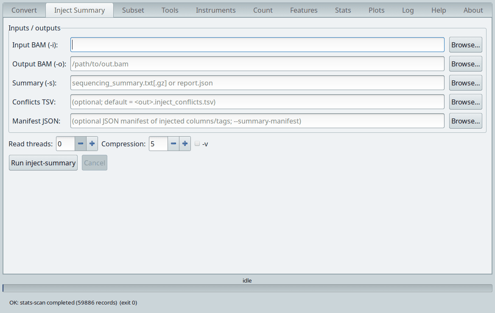

The standalone form of MinKNOW tag injection, for a BAM that is already in
genome space. Point **Summary (-s)** at a `sequencing_summary.txt`, its
gzipped form, or a MinKNOW `report*.json`. The two optional sidecars are worth
setting: **Conflicts TSV** records every tag Dorado had already written, and
**Manifest JSON** records which columns became which tags. If you are
converting anyway, the same work is available inside the Convert tab and saves
a pass over the file.

### Subset

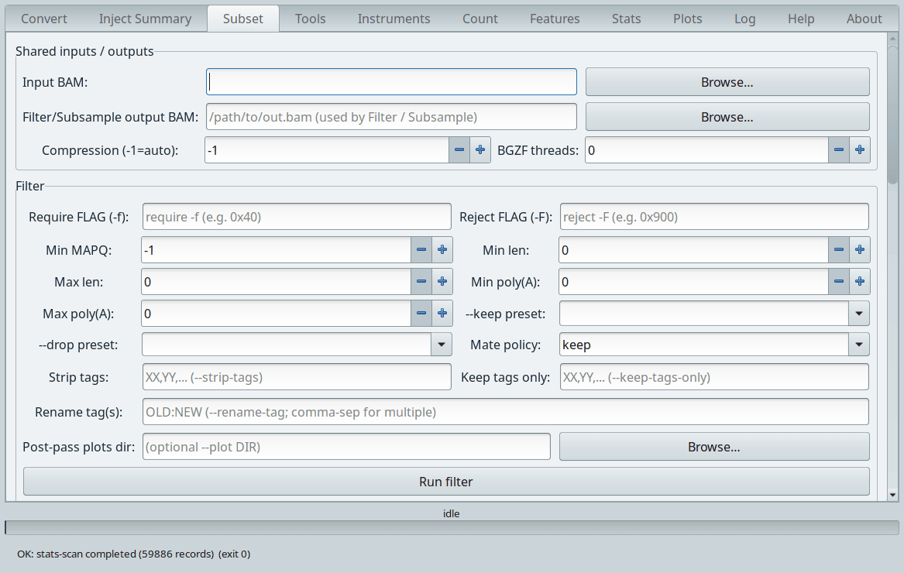

Three commands share one tab, because they share their inputs: `filter`,
`subsample` and `split`. The Filter group is the interesting one. FLAG
arithmetic is in **Require FLAG (-f)** and **Reject FLAG (-F)**, and the two
preset dropdowns beside them spell the common combinations out in words so you
do not have to remember that `0x900` means secondary or supplementary.

**Mate policy** decides what happens to a read whose mate the filter removed,
which is the question that makes filtering paired data awkward. **Strip tags**,
**Keep tags only** and **Rename tag(s)** are the tag surgery flags. **Post-pass
plots dir** renders the survivor distribution after the filter has run, which
is a fast way to see whether a threshold did what you meant.

### Tools

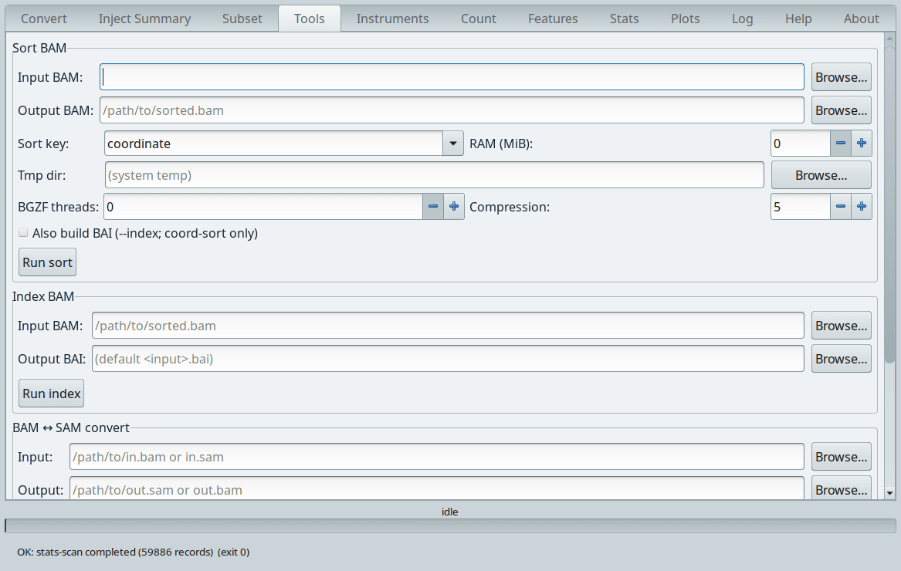

The everyday BAM chores, stacked in one scrolling page: sort, index, and BAM to
SAM conversion, with merge, cat and the rest below. **Sort key** offers
coordinate or name. **Also build BAI** saves the second step, and is offered
only for a coordinate sort because a name-sorted file cannot carry an index.

### Instruments

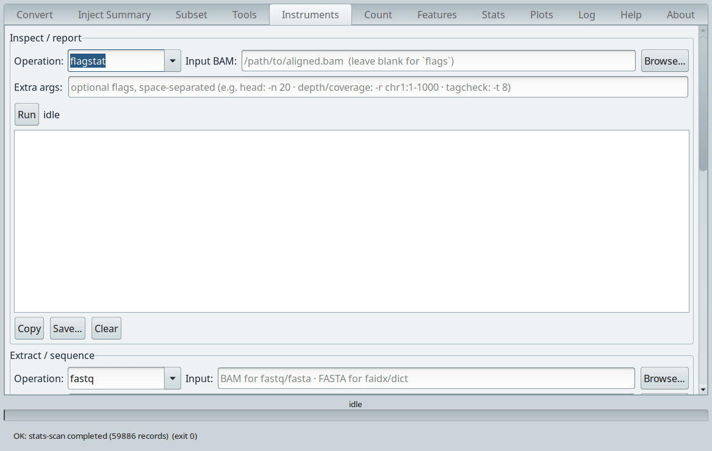

Everything that reads a BAM and prints something. The **Operation** dropdown in
the Inspect group carries `flagstat`, `idxstats`, `depth`, `coverage`, `head`,
`junctions`, `tagcheck`, `samples`, `flags` and `quickcheck`; output arrives in
the pane below with Copy and Save buttons. **Extra args** is a plain text field
passed through verbatim, which is how per-operation flags such as `-r
chr1:1-1000` reach the command.

The Extract group underneath covers `fastq`, `fasta`, `faidx` and `dict`. Note
which input each wants: the first two read a BAM, the last two read a FASTA.

### Count

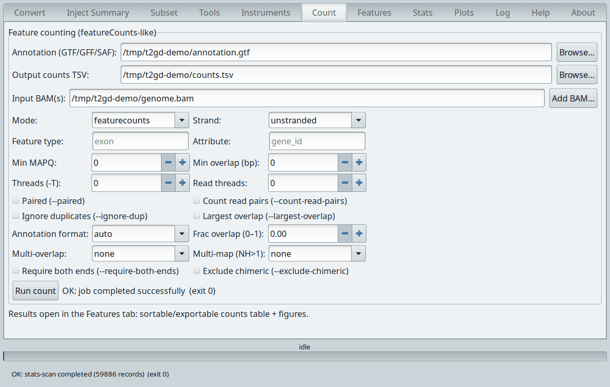

featureCounts-compatible summarisation. **Input BAM(s)** accepts several files
through **Add BAM**, and they become columns of one counts table.
**Feature type** and **Attribute** default to `exon` and `gene_id`, which is
gene-level counting; set them to `exon` and `transcript_id` for transcript
level. **Multi-overlap** and **Multi-map (NH>1)** are where a counting policy
argument usually lives, so they are dropdowns rather than tickboxes.

**Threads (-T)** follows the featureCounts spelling rather than T2GD's own
`-t`, deliberately, so that a command copied from a featureCounts protocol
still means what it said. Results open in the Features tab when the run
finishes.

### Features

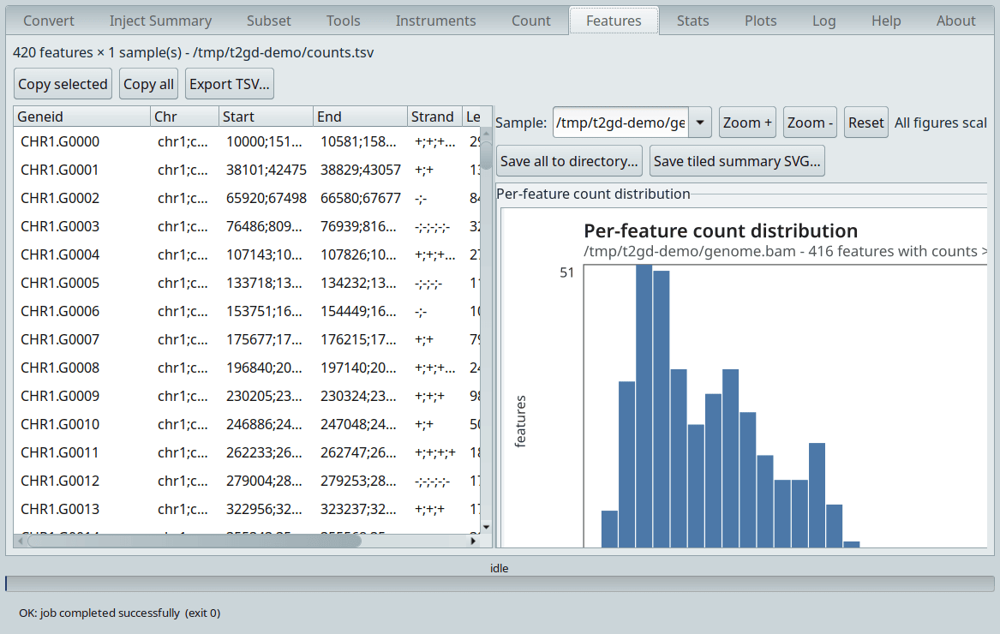

The counts table, sortable by any column, with the per-feature count
distribution beside it. **Export TSV** writes the same file `count` would have
written, so nothing is trapped in the window. The figure panel scales with
**Zoom** and saves as SVG.

### Stats

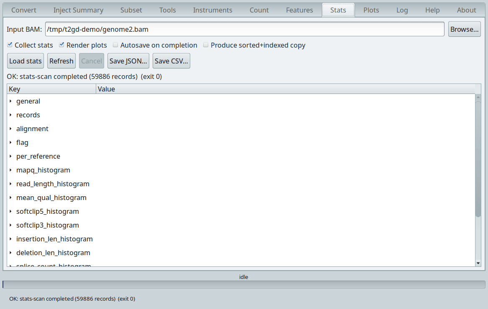

**Load stats** runs a scan over the input and fills the tree: general counts,
FLAG breakdown, per-reference totals, and histograms for MAPQ, read length,
mean quality, soft clip at each end, insertion and deletion length, and splice
count. Every branch expands to its numbers. **Save JSON** and **Save CSV**
write exactly what `--stats` and `--stats-csv` write on the command line.

**Produce sorted+indexed copy** is a convenience for the common case where the
file you want to inspect is not sorted yet.

### Plots

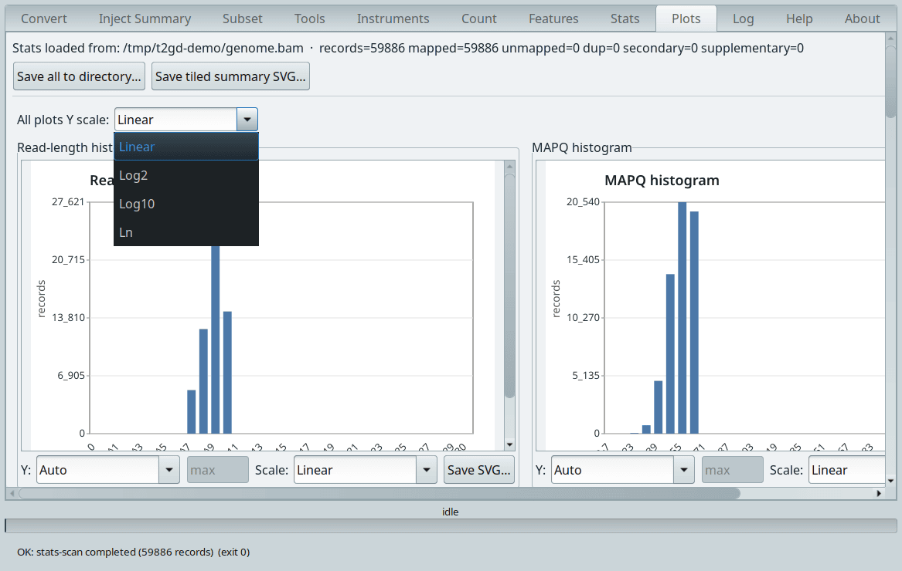

The histograms from Stats, drawn. Each panel has its own Y axis control, and
**All plots Y scale** at the top sets every panel at once: linear, log2, log10
or natural log. Log scaling is what makes a long-tailed read length
distribution readable, so it is worth reaching for early. **Save all to
directory** writes one SVG per panel, **Save tiled summary SVG** writes them as
a single sheet.

### Log

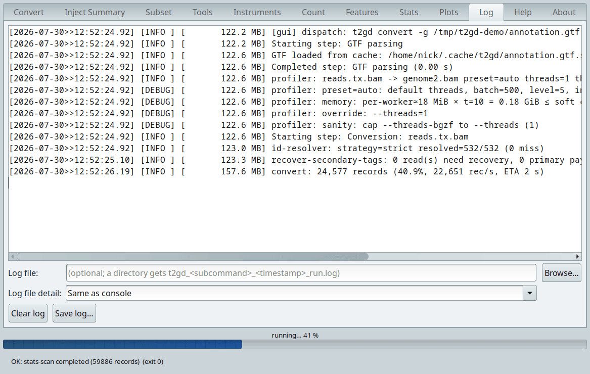

Every line the command line would have printed, with a timestamp, a level, and
the resident set size at that moment, so memory growth is visible as it
happens. The first line is the dispatched command. The progress bar and the
rate and ETA line update while the run proceeds; the run in the picture is
reading its annotation from the GTF cache, resolving all 532 transcript
identifiers with the strict resolver, and finding no reads that need tag
recovery.

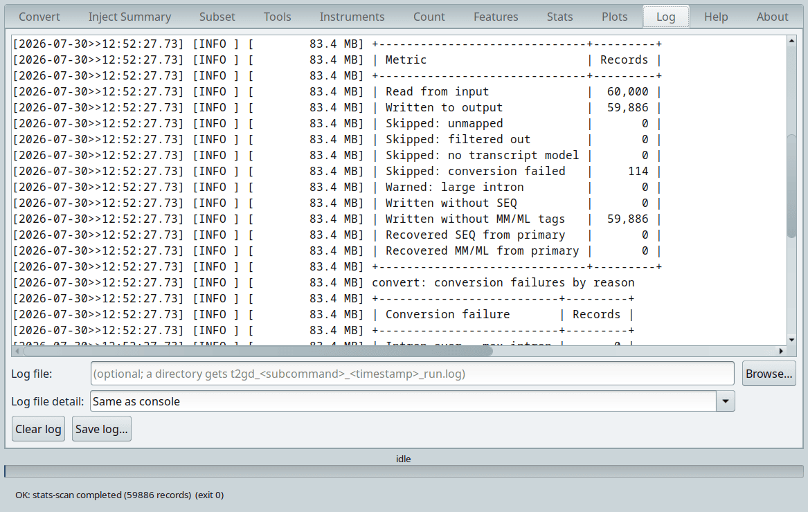

When the run finishes the summary table arrives, and it is the first thing to
read. Records in, records out, and a line for each reason a read did not make
it. A conversion failure count is followed by its own breakdown by reason. The
run above wrote 59,886 of 60,000 records and lost 114 to conversion failure,
which the second table attributes.

**Log file** saves the same stream to disk; give it a directory and the file is
named for the subcommand and the time. **Log file detail** lets the file be
more verbose than the console, which is the setting to use when reporting a
problem.

### Help and About

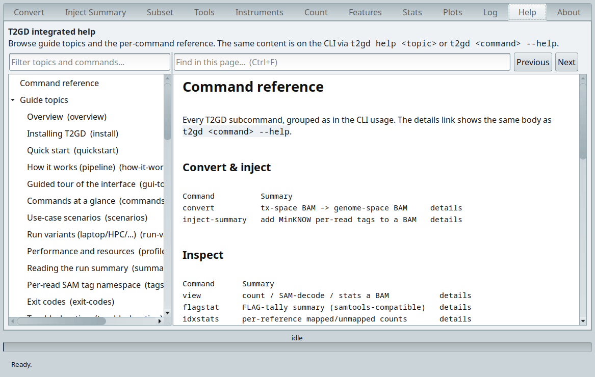

The Help tab is the built-in manual as a document reader: guide topics on the
left, per-command reference below them, working links between topics, and
in-page search on Ctrl+F. It is the same text as `t2gd-cli help <topic>` and
`t2gd-cli <command> --help`, so the window and the terminal cannot drift apart.

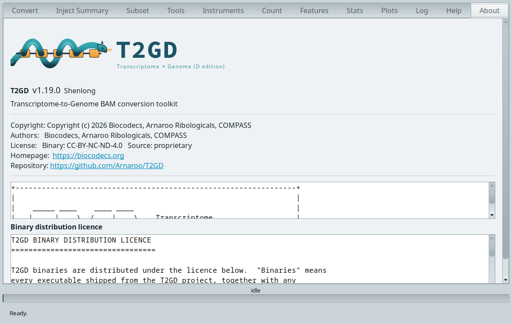

About carries the version and codename, the authors, the licence in full, and
the project links. Quote the version string from there when reporting anything.

### File chooser filters

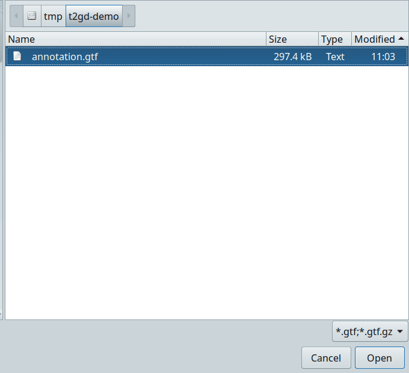

Every **Browse** button opens with a filter matching the field it belongs to,
so a GTF field offers `*.gtf` and `*.gtf.gz` and a BAM field offers `*.bam`.
Widen the filter with the dropdown at the bottom right if your files carry an
unusual extension.
